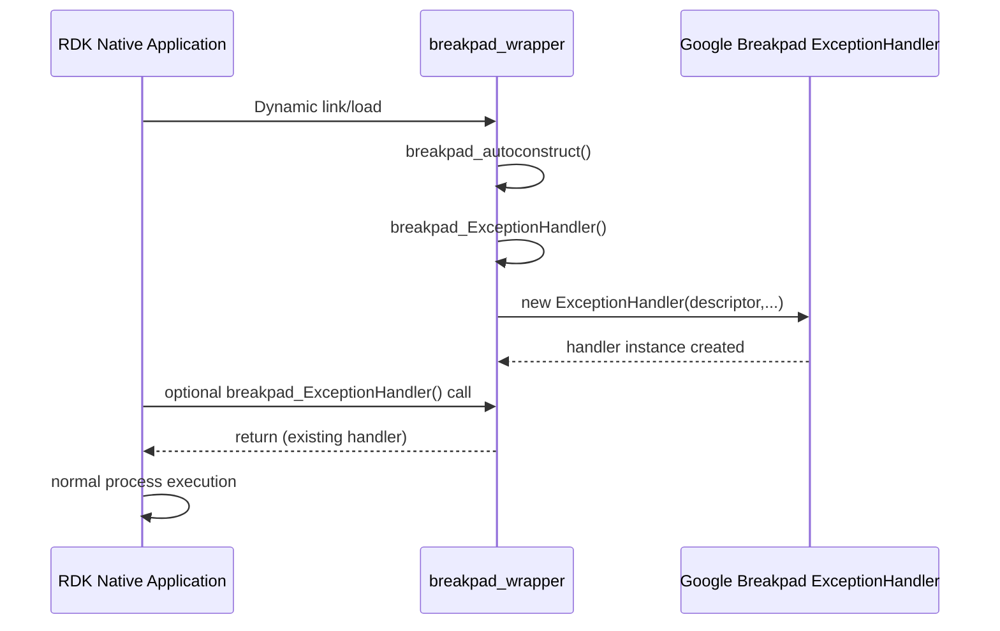

# Application Integration Sequence

## Purpose
Show expected initialization sequence between application and wrapper.

## Scope
Startup through exception-handler setup in non-crash path.

## Evidence Used
- `breakpad_wrapper.cpp`: constructor function and handler setup flow
- `breakpad_wrapper.h`: callable API

## Facts
- Constructor SHALL invoke handler setup during library load.
- Explicit API invocation of `breakpad_ExceptionHandler` SHALL no-op after first successful initialization.

## Inferences
- Application explicit call after load is optional and likely redundant.

## Unknowns / Manual Validation Needed
- Ordering details across dynamic loader stages for each target distro/toolchain.

