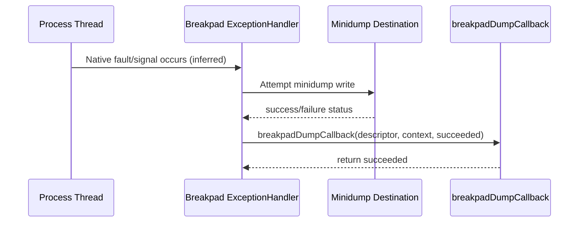

# Crash To Minidump Flow

## Purpose
Show crash-path flow from native fault to callback completion.

## Scope
Runtime flow implied by ExceptionHandler setup and callback implementation.

## Evidence Used
- `breakpad_wrapper.cpp`: `breakpadDumpCallback`, `breakpad_ExceptionHandler`
- Breakpad handler instantiation call signatures in `breakpad_wrapper.cpp`

## Facts
- Wrapper SHALL register `breakpadDumpCallback` when creating ExceptionHandler.
- Callback SHALL return the incoming `succeeded` status.

## Inferences
- Native crash interception and minidump write trigger by Breakpad are inferred from use of `google_breakpad::ExceptionHandler` API.

## Unknowns / Manual Validation Needed
- Whether callback is invoked for all relevant signal/fault classes in deployment.
- Detailed failure-mode behavior when dump write fails.

