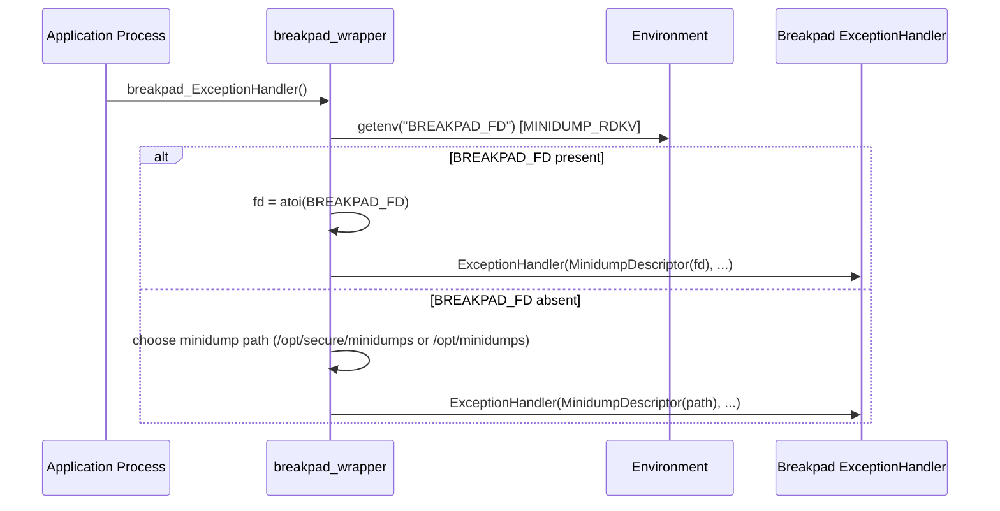

# FD-Based Output Sequence

## Purpose
Show verified and inferred behavior for `BREAKPAD_FD` controlled output path.

## Scope
`MINIDUMP_RDKV` code branch handling of env var and descriptor construction.

## Evidence Used
- `breakpad_wrapper.cpp`: `#ifdef MINIDUMP_RDKV` section
- `breakpad_wrapper.cpp`: `getenv("BREAKPAD_FD")`, `atoi`, descriptor constructors

## Facts
- Wrapper SHALL check `BREAKPAD_FD` only in `MINIDUMP_RDKV` builds.
- When `BREAKPAD_FD` is set, wrapper SHALL use fd-based descriptor constructor.
- When `BREAKPAD_FD` is unset, wrapper SHALL use path-based descriptor logic.

## Inferences
- Invalid numeric conversion effects are inferred from `atoi` semantics, not wrapper validation.

## Unknowns / Manual Validation Needed
- Runtime behavior when fd is invalid/unwritable/closed.
- Any fallback semantics inside real Breakpad implementation.

